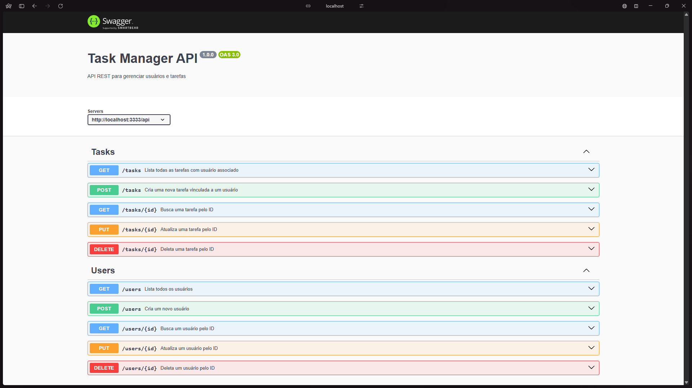

## Teste técnico: Estagiário Back-End (Node.js + TypeScript)



### Objetivo

Avaliar o conhecimento prático do candidato em Node.js, TypeScript, estrutura de projeto, integração com banco de dados e boas práticas no desenvolvimento de APIs REST.

### Desafio

Este projeto é uma API REST desenvolvida em **Node.js** com **Express**, **Prisma ORM** e **SQLite**, como parte de um teste técnico.
A aplicação permite gerenciar **usuários** e suas **tarefas**, com endpoints documentados via **Swagger**.

##  Tecnologias utilizadas
- [Node.js](https://nodejs.org/)
- [Express](https://expressjs.com/)
- [TypeScript](https://www.typescriptlang.org/)
- [Prisma ORM](https://www.prisma.io/)
- [SQLite](https://www.sqlite.org/) (Tive dificuldade com o PostgreSQL e optei por utilizar SQlite já que estou mais familiarizado)
- [Swagger](https://swagger.io/) (Para melhor visualização da documentação, teste API REST de forma padronizada)

## Como rodar o projeto

1. Clonar repositório
```bash
https://github.com/joao-sillva/task-user.git
cd task-user
```


2. Instalar dependências

```bash
npm install
```

3. Configurar variáveis de ambiente
Crie um arquivo .env na raiz do projeto baseado no .env.example:

```bash
DATABASE_URL="file:./dev.db"
PORT=3333
```

4. Rodar migrations
```bash
npx prisma migrate dev --name init
```

5. Rodar o servidor
```bash
npm run dev
```

- A API estará disponível em:
```bash
http://localhost:3333
```

A documentação Swagger estará em:
```bash
http://localhost:3333/docs
```

## Endpoints principais
- Usuários
```bash
GET /users → listar todos usuários
POST /users → criar usuário
GET /users/:id → buscar usuário por ID
PUT /users/:id → atualizar usuário
DELETE /users/:id → deletar usuário
```

- Tarefas
```bash
POST /tasks → criar tarefa
GET /tasks → listar todas tarefas
GET /tasks/:id → buscar tarefa por ID
PUT /tasks/:id → atualizar tarefa
DELETE /tasks/:id → deletar tarefa
```

## Regras de negócio implementadas

- Um usuário pode ter várias tarefas.
- Validações de entrada utilizando middlewares.
- Tratamento centralizado de erros.
- Documentação completa com Swagger.

## Autor

Projeto desenvolvido por João Victor ✨
